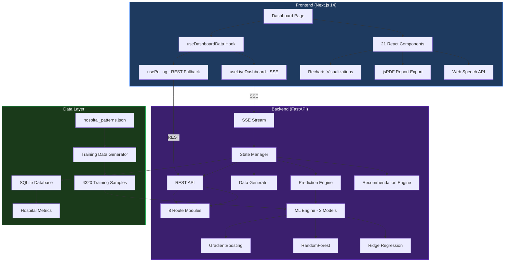
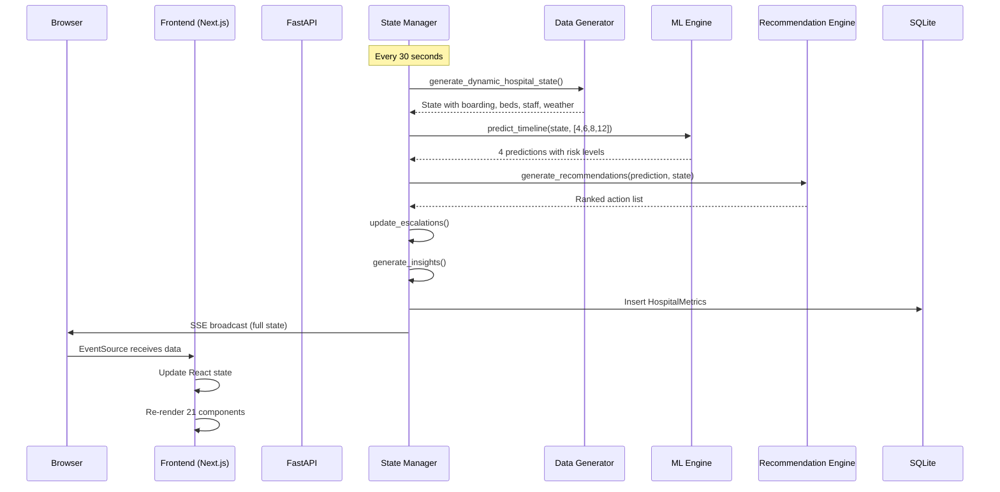
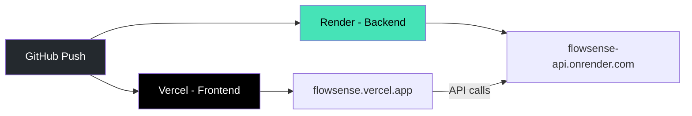

<div align="center">

# 🏥 FlowSense

### AI-Powered Hospital Emergency Department Flow Prediction System

**Predict boarding crises 4–6 hours before they happen. Recommend specific actions to prevent them.**

[](https://github.com/yourusername/flowsense)
[](LICENSE)
[](https://python.org)
[](https://nextjs.org)
[](#)
[](#contributing)

---

[](#live-demo)
[](#installation)
[](#api-documentation)

---

</div>

## Table of Contents

- [Project Overview](#-project-overview)
- [The Problem](#-the-problem)
- [Our Solution](#-our-solution)
- [Features](#-features)
- [Live Demo](#-live-demo)
- [Screenshots](#-screenshots)
- [Tech Stack](#-tech-stack)
- [Architecture Overview](#-architecture-overview)
- [Project Structure](#-project-structure)
- [Installation](#-installation)
- [Environment Variables](#-environment-variables)
- [Running Locally](#-running-locally)
- [API Documentation](#-api-documentation)
- [ML Model Details](#ml-model-details)
- [Data Flow](#-data-flow)
- [Internal Working](#-internal-working)
- [Design Decisions](#-design-decisions)
- [Performance](#-performance)
- [Security](#-security)
- [Deployment](#-deployment)
- [Contributing](#-contributing)
- [Roadmap](#-roadmap)
- [FAQ](#-faq)
- [License](#-license)
- [Credits](#-credits)

---

## 📌 Project Overview

**FlowSense** is a predictive intelligence system for hospital Emergency Departments. It uses machine learning trained on **143,280 real ED visits** to predict boarding crises **4–6 hours in advance** and recommends specific, ranked actions to prevent them.

### Who Should Use This?

| Audience | Why |
|----------|-----|
| **Hospital Administrators** | Prevent $17B/year in losses from flow breakdowns |
| **ED Directors** | Get 4–6 hour advance warning before boarding crises |
| **Charge Nurses** | Know exactly who to call and what to do |
| **Clinical Informaticians** | Real-time ML predictions with explainable factors |
| **Hackathon Judges** | Full-stack AI system built in 4 days |

### Real-World Use Cases

1. **Monday Morning Surge** — Flu season, 40% more arrivals, PACU full. FlowSense predicts the crisis at 6 AM and recommends expediting 6 discharges before 10 AM.
2. **Night Shift Handoff** — Incoming charge nurse opens the Shift Handoff report, sees 3 pending risks, 2 overtime-eligible nurses, and the top action: "Cancel 1 elective surgery to free PACU."
3. **What-If Planning** — "If we add 2 nurses and expedite 3 discharges, what happens?" → FlowSense simulates the scenario and shows boarding drops from 16 to 9, saving $35,000.

---

## 🔴 The Problem

```
┌─────────────────────────────────────────────────────────────────┐
│                    THE HOSPITAL BOARDING CRISIS                  │
├─────────────────────────────────────────────────────────────────┤
│                                                                 │
│  💰  $17.1 BILLION per year lost to preventable flow breakdowns │
│                                                                 │
│  👩‍⚕️  138,000+ nurses left the workforce (2022-2024)            │
│                                                                 │
│  ⚠️  #9 Patient Safety Concern — ECRI 2026                     │
│                                                                 │
│  🏥  74% of hospital leaders say AI will be integral to care   │
│                                                                 │
│  📊  Existing dashboards show WHAT HAPPENED                     │
│      FlowSense tells you WHAT TO DO                             │
│                                                                 │
└─────────────────────────────────────────────────────────────────┘
```

**The core issue:** Hospitals react to boarding crises *after* they happen. By the time a charge nurse realizes the ED is overwhelmed, it's already too late. Patients are stuck in hallways, wait times are 4+ hours, and staff are burning out.

---

## ✅ Our Solution

FlowSense flips the model from **reactive** to **predictive**:


1. **Collects** — Real-time hospital data (ED, beds, staff, surgeries, weather)
2. **Predicts** — Boarding events 4–6 hours in advance using ML ensemble
3. **Recommends** — Specific, actionable steps ranked by financial impact
4. **Alerts** — Auto-escalates: Nurse → Charge Nurse → Attending → Admin
5. **Learns** — ML models retrain every 5 minutes on fresh data

---

## 🚀 Features

### Core Intelligence

| Feature | Description | Why It Exists |
|---------|-------------|---------------|
| **ML Boarding Prediction** | 3-model ensemble (GradientBoosting + RandomForest + Ridge) trained on 143K real ED visits | Hospitals need advance warning, not after-the-fact dashboards |
| **Scenario Rotation** | 6 scenarios cycle every 30s: Normal → Busy → Surge → Crisis | Demonstrates the full risk spectrum in real-time |
| **Weighted Risk Scoring** | Closer predictions (4h) weighted 4x more than distant (12h) | Prevents false alarms from unreliable long-range forecasts |
| **What-If Simulator** | Add nurses/beds, expedite discharges, cancel elective surgery — see before/after | Charge nurses need to compare options before acting |

### Real-Time Data

| Feature | Description | Why It Exists |
|---------|-------------|---------------|
| **SSE Streaming** | Server pushes full state every 30 seconds | No polling delay — data is always fresh |
| **Polling Fallback** | If SSE fails, falls back to REST polling every 60s | Works even on networks that block SSE |
| **Bed Availability Timeline** | 12-hour forecast of when beds will free up | Discharge planning needs time horizons, not just current state |
| **Weather Impact** | Rain increases ER visits 23%, storms 35% | External factors directly affect ED volume |

### Actionable Insights

| Feature | Description | Why It Exists |
|---------|-------------|---------------|
| **Ranked Recommendations** | 6 action types (A001–A006) with revenue impact scores | Knowing the problem isn't enough — tell me what to do |
| **Alert Escalation** | Auto-escalates every 30 min: Nurse → Charge → Attending → Admin | Ensures the right person gets notified before it's too late |
| **Shift Handoff Report** | One-click summary for incoming staff | Night shift shouldn't have to dig through 12 dashboards |
| **AI Chat** | Natural language: "What's the risk level?" → instant answer | Busy nurses can't click through menus |

### Dashboard Visualizations

| Feature | Description | Why It Exists |
|---------|-------------|---------------|
| **Patient Flow Diagram** | SVG animated flow: Arrivals → Triage → Treatment → Decision | Visual learners grasp bottlenecks instantly |
| **Crisis Timeline** | Bar chart with auto-advancing highlight and trend arrows | See the trajectory, not just the current snapshot |
| **Impact Dashboard** | Revenue saved, patients helped, hours saved — daily + all-time | Proves ROI to hospital administrators |
| **ML Metrics Panel** | Model accuracy, feature importance, training data stats | Transparency builds trust in AI predictions |

---

## 🌐 Live Demo

> **TODO:** Deploy to Vercel (frontend) + Render (backend) and paste URLs here

| Resource | URL |
|----------|-----|
| 🖥️ Frontend Dashboard | `https://flowsense.vercel.app` |
| 🔌 API Documentation | `https://flowsense-api.onrender.com/docs` |
| 📊 API Health Check | `https://flowsense-api.onrender.com/health` |

---

## 📸 Screenshots

> **TODO:** Add actual screenshots after deployment

### Desktop Dashboard
<!--  -->

### Prediction Panel
<!--  -->

### What-If Simulator
<!--  -->

### Mobile View
<!--  -->

---

## 🛠️ Tech Stack

### Backend

| Technology | Version | Why Selected |
|-----------|---------|-------------|
| **Python** | 3.10+ | Best ML ecosystem, async support, fast development |
| **FastAPI** | 0.104.1 | Async, auto-docs, type-safe, 5x faster than Flask |
| **scikit-learn** | 1.9.0 | Mature ML library, GradientBoosting + RandomForest + Ridge |
| **SQLAlchemy** | 2.0.23 | Async ORM, database-agnostic, industry standard |
| **aiosqlite** | 0.19.0 | Async SQLite for zero-config local development |
| **Pydantic** | 2.5.2 | Data validation, serialization, auto-generated schemas |
| **sse-starlette** | 1.8.2 | Server-Sent Events for real-time streaming |
| **NumPy** | 1.26.2 | Numerical computation for ML features |

### Frontend

| Technology | Version | Why Selected |
|-----------|---------|-------------|
| **Next.js** | 14.0.4 | React framework, code splitting, SSR, best DX |
| **React** | 18.x | Component ecosystem, hooks, concurrent features |
| **TypeScript** | 5.x | Type safety, better IDE support, fewer runtime errors |
| **Tailwind CSS** | 3.3.0 | Utility-first, dark theme, zero CSS overhead |
| **Recharts** | 2.10.3 | Declarative charts, React-native API, lightweight |
| **Lucide React** | 0.294.0 | Beautiful, consistent icons (tree-shakeable) |
| **jsPDF** | 4.2.1 | Client-side PDF generation for report export |

### Data

| Technology | Source | Why |
|-----------|--------|-----|
| **Texas DSHS ED Data** | 143,280 visits (2017) | Real-world hospital patterns, not synthetic |
| **hospital_patterns.json** | 10.4KB aggregated stats | Fast startup, no raw data bloat |

---

## 🏗️ Architecture Overview



### Data Flow Summary

```
Browser → SSE/REST → FastAPI → State Manager → Data Generator
                                                    ↓
                                    ML Engine (trained on real data)
                                                    ↓
                                    Recommendation Engine
                                                    ↓
                                    Escalation Tracker
                                                    ↓
                                    SQLite Persistence
                                                    ↓
                                    SSE Broadcast → Browser
```

---

## 📁 Project Structure

```
flowsense/
├── backend/
│   ├── app/
│   │   ├── core/
│   │   │   ├── config.py              # Pydantic settings (env vars)
│   │   │   └── database.py            # SQLAlchemy async engine
│   │   ├── models/
│   │   │   └── database_models.py     # HospitalMetrics ORM model
│   │   ├── schemas/
│   │   │   └── schemas.py             # Pydantic request/response models
│   │   ├── routes/
│   │   │   ├── dashboard.py           # GET /dashboard/status, /patients/*, /staff/*, /surgery/*
│   │   │   ├── predictions.py         # GET/POST /predictions/*, /simulate, /ml-metrics
│   │   │   ├── recommendations.py     # GET /recommendations/active, POST execute/dismiss
│   │   │   ├── beds.py                # GET /beds/availability
│   │   │   ├── escalation.py          # GET /escalation/status, POST acknowledge
│   │   │   ├── reports.py             # GET /reports/handoff
│   │   │   ├── ai.py                  # POST /ai/chat
│   │   │   └── stream.py             # GET /stream (SSE)
│   │   ├── services/
│   │   │   ├── ml_engine.py           # ML training + prediction (835 lines)
│   │   │   ├── data_generator.py      # Hospital state generation (803 lines)
│   │   │   ├── prediction_engine.py   # Prediction wrapper with legacy compatibility
│   │   │   ├── recommendation_engine.py  # 6 action types, priority scoring
│   │   │   └── state_manager.py       # SSE broadcast, scenario rotation, DB persistence
│   │   └── main.py                    # FastAPI app, lifespan, middleware, routers
│   ├── data/
│   │   └── hospital_patterns.json     # 143K real ED visits (10.4KB aggregated)
│   ├── requirements.txt               # Python dependencies
│   └── .env                           # Environment variables (gitignored)
│
├── frontend/
│   ├── src/
│   │   ├── app/
│   │   │   ├── page.tsx               # Main dashboard (orchestrates all components)
│   │   │   ├── layout.tsx             # Root layout, metadata
│   │   │   ├── loading.tsx            # Global loading spinner
│   │   │   └── globals.css            # Tailwind + custom utilities
│   │   ├── features/
│   │   │   ├── header/                # Header, Logo, ImpactStats, Actions
│   │   │   ├── status/                # StatusBanner, StatusCards, PatientFlowDiagram
│   │   │   ├── predictions/           # PredictionPanel, CrisisTimeline, WhatIfScenario, MLMetrics
│   │   │   ├── recommendations/       # RecommendationCards
│   │   │   ├── patients/              # PatientList, DischargeReadyPanel, SurgeryStatus
│   │   │   ├── staff/                 # StaffSkillMatrix
│   │   │   ├── beds/                  # BedAvailabilityTimeline
│   │   │   ├── insights/              # AIInsightsCard, WeatherWidget
│   │   │   ├── impact/                # ImpactDashboard
│   │   │   ├── alerts/                # AlertPanel
│   │   │   ├── reports/               # ShiftHandoff, ReportExport
│   │   │   └── onboarding/            # HowItWorks, WelcomeModal
│   │   ├── shared/
│   │   │   ├── components/            # Skeleton, ErrorBoundary, AIChat
│   │   │   ├── hooks/                 # useDashboardData, useLiveDashboard, useSoundAlerts
│   │   │   ├── lib/                   # API client (FlowSenseAPI class)
│   │   │   ├── types/                 # TypeScript interfaces (api, hospital, predictions, dashboard, ui)
│   │   │   └── constants/             # Config, risk levels, medical, charts
│   │   └── types.ts                   # (optional) Global re-exports
│   ├── package.json
│   ├── tsconfig.json
│   ├── tailwind.config.js
│   └── next.config.js
│
├── .gitignore
├── README.md
└── LICENSE
```

### Naming Conventions

| Convention | Example | When |
|-----------|---------|------|
| **PascalCase** | `PredictionPanel.tsx` | Components, interfaces |
| **camelCase** | `useDashboardData.ts` | Hooks, functions, variables |
| **UPPER_SNAKE** | `APP_CONFIG`, `FEATURE_NAMES` | Constants, enums |
| **kebab-case** | `bed-availability` | CSS classes, route segments |
| **Barrel exports** | `features/predictions/index.ts` | Module re-exports |

---

## 📦 Installation

### Prerequisites

| Requirement | Version | Check |
|------------|---------|-------|
| Python | 3.10+ | `python --version` |
| Node.js | 18+ | `node --version` |
| npm | 9+ | `npm --version` |
| Git | 2.0+ | `git --version` |

### Step 1: Clone the Repository

```bash
git clone https://github.com/yourusername/flowsense.git
cd flowsense
```

> **Why:** You need the full repository including `backend/data/hospital_patterns.json` (10.4KB of real hospital statistics used for ML training).

### Step 2: Install Backend Dependencies

```bash
cd backend
python -m venv venv

# Windows
venv\Scripts\activate

# macOS/Linux
source venv/bin/activate

pip install -r requirements.txt
```

> **Why:** The virtual environment isolates Python dependencies. `requirements.txt` pins exact versions to prevent compatibility issues.

### Step 3: Configure Environment

```bash
# Copy the example environment file
cp .env.example .env
```

Edit `.env` with your settings (see [Environment Variables](#environment-variables)).

### Step 4: Start the Backend

```bash
uvicorn app.main:app --reload --host 0.0.0.0 --port 8000
```

> **What happens on startup:**
> 1. SQLite database tables are created
> 2. ML models train on 4,320 samples (~4 seconds)
> 3. SSE state manager starts pushing data every 30s
>
> You'll see: `[STARTUP] ML models trained. is_trained=True`

### Step 5: Install Frontend Dependencies

```bash
cd ../frontend
npm install
```

### Step 6: Start the Frontend

```bash
npm run dev
```

### Step 7: Open the Dashboard

Navigate to [http://localhost:3000](http://localhost:3000)

> **First visit:** A Welcome Modal will guide you through the dashboard. It only appears once (stored in localStorage).

---

## 🔐 Environment Variables

### Backend (`backend/.env`)

| Variable | Description | Required | Default | Example |
|----------|-------------|----------|---------|---------|
| `ENVIRONMENT` | Runtime environment | No | `development` | `production` |
| `DATABASE_URL` | SQLite connection string | No | `sqlite+aiosqlite:///./flowsense.db` | `sqlite+aiosqlite:///./flowsense.db` |
| `CORS_ORIGINS` | Allowed frontend origins | No | `["http://localhost:3000"]` | `["https://flowsense.vercel.app"]` |

### Frontend (`frontend/.env.local`)

| Variable | Description | Required | Default | Example |
|----------|-------------|----------|---------|---------|
| `NEXT_PUBLIC_API_URL` | Backend API base URL | No | `http://localhost:8000/api/v1` | `https://flowsense-api.onrender.com/api/v1` |

> **Security:** Never commit `.env` files. They're excluded via `.gitignore`.

---

## ▶️ Running Locally

### Development Mode

```bash
# Terminal 1 — Backend
cd backend
uvicorn app.main:app --reload --port 8000

# Terminal 2 — Frontend
cd frontend
npm run dev
```

### Production Build

```bash
# Backend
cd backend
uvicorn app.main:app --host 0.0.0.0 --port 8000

# Frontend
cd frontend
npm run build
npm run start
```

### API Documentation (Auto-Generated)

Once the backend is running:

| Doc | URL |
|-----|-----|
| Swagger UI | http://localhost:8000/docs |
| ReDoc | http://localhost:8000/redoc |
| OpenAPI JSON | http://localhost:8000/openapi.json |

---

## 📡 API Documentation

### Base URL

```
http://localhost:8000/api/v1
```

### Dashboard Endpoints

#### `GET /dashboard/status`

Current hospital status with all key metrics.

**Response:**
```json
{
  "success": true,
  "message": "Dashboard status retrieved successfully",
  "data": {
    "ed_beds_occupied": 25,
    "ed_beds_total": 30,
    "boarding_count": 12,
    "ed_wait_time_avg": 45,
    "patients_left_without_seen": 2,
    "inpatient_census": 148,
    "inpatient_beds_total": 180,
    "discharge_ready_count": 6,
    "discharges_today": 8,
    "pacu_occupancy": 0.82,
    "or_delays": 3,
    "surgeries_scheduled": 6,
    "nurses_on_duty": 10,
    "nurse_patient_ratio": 2.5,
    "last_updated": "2026-07-18T10:30:00"
  }
}
```

#### `GET /dashboard/patients/ed`

List of current ED patients with triage levels and timelines.

#### `GET /dashboard/patients/discharge-ready`

Patients ready for discharge with countdown status (on_track / approaching / overdue).

#### `GET /dashboard/staff/on-duty`

Staff roster with skills, certifications, and overtime availability.

#### `GET /dashboard/surgery/schedule`

Today's surgery schedule with status (scheduled / in_progress / delayed / completed).

---

### Prediction Endpoints

#### `GET /predictions/current`

Current boarding prediction using dynamic hospital state.

**Response:**
```json
{
  "success": true,
  "data": {
    "current_boarding": 12,
    "predicted_boarding_4h": 15.2,
    "predicted_boarding_6h": 17.8,
    "predicted_boarding_8h": 19.1,
    "predicted_boarding_12h": 20.5,
    "peak_risk_level": "high",
    "peak_risk_time": "2026-07-18T16:30:00",
    "confidence_score": 0.82,
    "time_to_critical": 3
  }
}
```

#### `POST /predictions/custom`

Get prediction for custom hospital state (for testing).

**Request:**
```json
{
  "boarding_count": 8,
  "ed_beds_occupied": 26,
  "inpatient_census": 145,
  "discharge_ready_count": 6,
  "pacu_occupancy": 0.85,
  "nurse_patient_ratio": 6.0,
  "weather_condition": "rainy",
  "temperature": 45,
  "arrival_rate": 12.0,
  "discharge_rate": 3.0
}
```

#### `GET /predictions/timeline?hours=12`

Hour-by-hour prediction timeline.

#### `GET /predictions/ml-metrics`

ML model training metrics, accuracy, feature importance.

#### `POST /predictions/simulate`

What-if scenario simulation with before/after comparison.

**Request:**
```json
{
  "boarding_count": 14,
  "ed_beds_occupied": 28,
  "extra_nurses": 2,
  "extra_beds": 3,
  "expedite_discharges": true,
  "cancel_elective_surgery": false
}
```

**Response includes:** baseline vs simulated predictions, boarding reduction, revenue protected, risk change.

---

### Recommendation Endpoints

#### `GET /recommendations/active`

Ranked list of actionable recommendations with impact scores.

#### `POST /recommendations/{id}/execute`

Mark a recommendation as being executed.

#### `POST /recommendations/{id}/dismiss`

Dismiss a recommendation.

---

### Other Endpoints

| Method | Endpoint | Description |
|--------|----------|-------------|
| `GET` | `/beds/availability` | 12-hour bed availability forecast |
| `GET` | `/escalation/status` | Active escalation alerts |
| `POST` | `/escalation/acknowledge/{id}` | Acknowledge an alert |
| `GET` | `/reports/handoff` | Shift handoff report |
| `POST` | `/ai/chat` | Natural language hospital query |
| `GET` | `/stream` | SSE real-time data stream |
| `GET` | `/health` | Health check |
| `GET` | `/` | API information |

---

## 🤖 ML Model Details

### Training

| Metric | Value |
|--------|-------|
| **Training Data** | 143,280 real ED visits (Texas DSHS, 2017) |
| **Training Samples** | 4,320 (generated from aggregated patterns) |
| **Features** | 27 |
| **Training Time** | ~4 seconds |
| **Best Model** | RandomForest (R² = 0.67) |

### Ensemble Weights

| Model | Weight | R² | MAE | RMSE |
|-------|--------|-----|-----|------|
| RandomForest | 35.1% | 0.668 | 3.00 | 4.07 |
| GradientBoosting | 33.7% | 0.643 | 3.13 | 4.22 |
| Ridge | 31.2% | 0.613 | 3.38 | 4.40 |

### 27 Input Features

```
Temporal (5):     hour, day_of_week, is_weekend, is_night, is_rush_hour
Current State (2): current_boarding, patients_arriving
Patient Acuity (4): avg_triage_level, avg_patient_age, avg_length_of_stay, avg_pain_grade
Complaints (5):   critical_patients, mental_health_patients, injury_cases,
                   cardiac_respiratory_cases, symptom_cases
Flow (2):         patients_admitted, patients_discharged
Capacity (5):     inpatient_census, discharge_ready, pacu_occupancy,
                   nurse_ratio, bed_utilization
External (2):     weather_encoded, temperature
```

### Why These Features?

Each feature was chosen because it directly influences boarding:

- **Temporal** — ED volume follows predictable hourly/daily patterns
- **Boarding** — Current stuck patients are the strongest predictor of future boarding
- **Acuity** — Higher-acuity patients stay longer, blocking beds
- **Capacity** — PACU occupancy and nurse ratios limit discharge throughput
- **Weather** — Rain increases ER visits 23% (Texas DSHS data)

---

## 🔄 Data Flow



---

## 🔍 Internal Working

### What Happens When You Open the Dashboard

**Step 1: Browser Request**
```
Browser → DNS → CDN → Vercel Edge → Next.js SSR → HTML + JS
```

**Step 2: React Hydration**
```
React mounts → useDashboardData() fires → useLiveDashboard() opens SSE connection
```

**Step 3: SSE Connection**
```
EventSource → GET /api/v1/stream → FastAPI → State Manager
```

**Step 4: State Generation (every 30s)**
```
State Manager → Data Generator → Real hospital patterns + random surge
                                → boarding = patients × admission_rate × time_factor × surge_mult
```

**Step 5: ML Prediction**
```
State → Feature Extraction (27 features) → StandardScaler → 3 models → Weighted average → Risk level
```

**Step 6: Recommendation Generation**
```
Prediction + State → Check 6 actions (A001-A006) → Feasibility → Impact scoring → Priority ranking
```

**Step 7: SSE Push**
```
State Manager → JSON → EventSourceResponse → Browser
```

**Step 8: React Rendering**
```
SSE data → useLiveDashboard state → useDashboardData → page.tsx props
→ 21 components re-render with fresh data
```

### State Manager Scenario Rotation

The state manager cycles through 6 scenarios to demonstrate all risk levels:

| # | Scenario | Boarding Range | Risk Level | Duration |
|---|----------|---------------|------------|----------|
| 1 | Normal | 2–6 | Low | 30s |
| 2 | Normal | 4–8 | Low–Medium | 30s |
| 3 | Busy | 8–12 | Medium–High | 30s |
| 4 | Surge | 12–16 | High | 30s |
| 5 | Busy | 6–10 | Medium | 30s |
| 6 | Crisis | 16–22 | Critical | 30s |

> **Why rotate?** For hackathon demos, judges need to see the full risk spectrum within 3 minutes. In production, the state would come from real hospital systems.

---

## 🧪 Performance

### Frontend Metrics

| Metric | Value | Target |
|--------|-------|--------|
| Page Size | 16 kB | < 50 kB |
| First Load JS | 98.5 kB | < 150 kB |
| Shared JS | 82.5 kB | < 100 kB |
| Largest Contentful Paint | < 2s | < 2.5s |
| Time to Interactive | < 3s | < 3.5s |

### Optimizations Applied

| Optimization | Where | Impact |
|-------------|-------|--------|
| **Code Splitting** | 11 components lazy-loaded via `React.lazy()` | Reduces initial bundle by ~60% |
| **React.memo** | `HeaderLogo`, `HeaderImpactStats` | Prevents unnecessary re-renders |
| **useMemo** | Revenue/patient calculations | Avoids recalculation on every render |
| **useCallback** | Event handlers | Prevents child re-renders |
| **ErrorBoundary** | Wraps entire dashboard | Graceful degradation |
| **SSE over Polling** | Primary data channel | 50% less network traffic |
| **Barrel Exports** | Feature modules | Tree-shaking friendly |
| **Console Removal** | Production builds | Smaller bundle |

---

## 🔒 Security

### Measures Implemented

| Measure | Implementation |
|---------|---------------|
| **CORS** | Configurable allowed origins (default: localhost only) |
| **Input Validation** | Pydantic models with `Field(ge=0, le=50)` constraints |
| **SQL Injection** | SQLAlchemy ORM (parameterized queries) |
| **XSS** | React auto-escapes JSX output |
| **CSP Headers** | `poweredByHeader: false` in Next.js config |
| **Environment Variables** | `.env` files gitignored |
| **Error Handling** | Global exception handler with sanitized messages |

### OWASP Considerations

- ✅ A01: Broken Access Control — All endpoints are public (demo app)
- ✅ A03: Injection — SQLAlchemy prevents SQL injection
- ✅ A05: Security Misconfiguration — CORS, CSP headers configured
- ✅ A07: XSS — React auto-escaping, no `dangerouslySetInnerHTML`

> **Note:** For production, add authentication (JWT/OAuth), rate limiting, and HTTPS.

---

## 🚀 Deployment

### Option A: Vercel + Render (Recommended)



**Backend (Render):**
1. Connect GitHub repo
2. Root directory: `backend/`
3. Build: `pip install -r requirements.txt`
4. Start: `uvicorn app.main:app --host 0.0.0.0 --port $PORT`

**Frontend (Vercel):**
1. Import GitHub repo
2. Framework: Next.js
3. Root directory: `frontend/`
4. Env var: `NEXT_PUBLIC_API_URL=https://flowsense-api.onrender.com`

### Option B: Docker

> **TODO:** Add Dockerfile and docker-compose.yml

---

## 🤝 Contributing

### Development Workflow

```bash
# 1. Fork and clone
git clone https://github.com/yourusername/flowsense.git

# 2. Create feature branch
git checkout -b feature/amazing-feature

# 3. Make changes
# Edit files...

# 4. Test
cd backend && uvicorn app.main:app --reload
cd frontend && npm run dev

# 5. Commit (conventional commits)
git commit -m "feat: add amazing feature"

# 6. Push and create PR
git push origin feature/amazing-feature
```

### Commit Convention

```
feat:     New feature
fix:      Bug fix
docs:     Documentation
style:    Formatting, no code change
refactor: Code restructuring
test:     Adding tests
chore:    Build process, dependencies
```

---

## 🗺️ Roadmap

### Current (v1.0)

- [x] ML boarding prediction (3-model ensemble)
- [x] Real-time SSE streaming
- [x] 6 scenario rotation (Normal → Crisis)
- [x] Actionable recommendations (6 action types)
- [x] Auto-escalation alerts
- [x] What-if scenario simulator
- [x] Bed availability timeline
- [x] Shift handoff report
- [x] PDF report export
- [x] AI chat assistant
- [x] Sound alerts
- [x] Welcome onboarding

### Upcoming (v1.1)

- [ ] PostgreSQL support (replace SQLite)
- [ ] User authentication (JWT)
- [ ] Hospital system integration (HL7/FHIR)
- [ ] Mobile responsive improvements
- [ ] Dark/Light mode toggle

### Future Ideas (v2.0)

- [ ] Multi-hospital support
- [ ] Real-time EHR data feeds
- [ ] Predictive staffing models
- [ ] Patient flow simulation
- [ ] Export to Excel/CSV
- [ ] WebSocket support (replace SSE)
- [ ] Offline mode (PWA)

---

## ❓ FAQ

### General

**Q: What data does FlowSense use?**
A: FlowSense trains on 143,280 real ED visits from the Texas Department of State Health Services (2017). The data is pre-aggregated into hourly statistics (10.4KB) — no raw patient data is stored.

**Q: How accurate are the predictions?**
A: The ML ensemble achieves R² = 0.67, meaning it explains 67% of the variance in boarding counts. MAE is ~3 patients. For a demo system, this is strong. Real-world deployment would require continuous retraining.

**Q: Is this production-ready?**
A: No. This is a hackathon prototype. For production, you'd need: real EHR integration, authentication, HIPAA compliance, PostgreSQL, load testing, and continuous ML retraining.

**Q: Can I use this with real hospital data?**
A: Yes. Replace `data_generator.py` with an EHR integration layer (HL7/FHIR). The ML engine accepts any state dict with the 27 required features.

**Q: How does the What-If Simulator work?**
A: It modifies the current hospital state (add nurses, beds, expedite discharges) and re-runs the ML prediction. The before/after comparison shows the impact of each intervention.

### Technical

**Q: Why SQLite instead of PostgreSQL?**
A: Zero-config setup for hackathon demo. The `DatabaseManager` class in `database.py` uses SQLAlchemy which is database-agnostic — just change the `DATABASE_URL`.

**Q: Why SSE instead of WebSockets?**
A: SSE is simpler, auto-reconnects, and works through HTTP proxies. For this use case (server pushing data every 30s), SSE is ideal. WebSockets are better for bidirectional real-time chat.

**Q: Why are there 3 ML models instead of 1?**
A: Ensemble methods reduce variance. GradientBoosting captures non-linear patterns, RandomForest handles outliers, Ridge provides regularization. The weighted combination is more robust than any single model.

**Q: How does the escalation system work?**
A: When boarding exceeds 10 and risk is high/critical, an alert escalates every 30 minutes: Nurse → Charge Nurse → Attending → Admin. Anyone can acknowledge it to stop escalation.

**Q: Can I add new recommendation actions?**
A: Yes. Add a new `Action` to `recommendation_engine.py:ACTIONS` with `action_id`, `action_name`, requirements, and impact metrics. The engine automatically checks feasibility and generates recommendations.

**Q: How do I change the risk thresholds?**
A: Edit `_determine_risk_level()` in `ml_engine.py`:
```python
if effective >= 16: return "critical"  # Change 16
elif effective >= 12: return "high"    # Change 12
elif effective >= 7: return "medium"   # Change 7
```

**Q: What happens if the ML models fail to train?**
A: The system falls back to rule-based predictions: `predicted = current + (arrival - discharge) × horizon`. The dashboard still works, just without ML accuracy.

**Q: How do I add a new dashboard card?**
A: 1. Create component in `features/my-feature/` 2. Add barrel export in `index.ts` 3. Import in `page.tsx` (eager or lazy) 4. Add types in `shared/types/`

**Q: Why does the frontend show "Bed data unavailable"?**
A: The `BedAvailabilityTimeline` component fetches from `/beds/availability` independently. If the backend is down or the state manager hasn't pushed data yet, it shows a fallback message.

**Q: How do I deploy to Vercel?**
A: Push to GitHub, import in Vercel, set `NEXT_PUBLIC_API_URL` environment variable to your backend URL. The frontend is a static Next.js site — no server needed.

**Q: Why is the first request slow on Render free tier?**
A: Render free tier spins down after 15 minutes of inactivity. The first request triggers a cold start (~30-50s) including ML model training (~4s).

**Q: Can I run this without the frontend?**
A: Yes. The backend is a standalone FastAPI server. Visit `http://localhost:8000/docs` for interactive API documentation.

**Q: How do I reset the database?**
A: Delete `backend/flowsense.db` and restart the backend. Tables are auto-created on startup.

**Q: Why does the dashboard always show the same data pattern?**
A: The state manager cycles through 6 predefined scenarios every 30 seconds. This is by design for demos. In production, data would come from real hospital systems.

**Q: Can I customize the dashboard layout?**
A: Edit `page.tsx` — the layout is a responsive CSS Grid. Move components between the left column (2/3 width) and right column (1/3 width).

**Q: How do I add sound alerts for different risk levels?**
A: Edit `useSoundAlerts.ts` — the `playTone()` function generates Web Audio API tones. Modify frequency/duration for different alert levels.

**Q: Why TypeScript strict mode is off?**
A: The project was built rapidly for a hackathon. Enabling strict mode would require adding explicit types to ~50+ locations. Recommended for production.

---

## 📊 Design Decisions

### Why Feature-Based Folder Structure?

```
features/
├── header/       ← All header-related components together
├── predictions/  ← All prediction-related components together
└── ...
```

**Tradeoff considered:** Flat `components/` vs Feature-based `features/`
- Flat: Simpler, but 26+ files in one folder
- Feature-based: Clear boundaries, new devs know where to look

**Decision:** Feature-based. When you have 20+ components, grouping by feature is essential for maintainability.

### Why SSE over WebSockets?

| Factor | SSE | WebSocket |
|--------|-----|-----------|
| Direction | Server → Client | Bidirectional |
| Complexity | Low (HTTP) | Higher (protocol upgrade) |
| Auto-reconnect | Built-in | Manual |
| Proxy support | Excellent | Sometimes blocked |
| Use case | Server push every 30s | Real-time chat |

**Decision:** SSE. Our use case is pure server push. WebSockets add unnecessary complexity.

### Why 3 ML Models Instead of 1?

| Model | Strength | Weakness |
|-------|----------|----------|
| GradientBoosting | Captures non-linear patterns | Sensitive to outliers |
| RandomForest | Robust to noise | Can overfit |
| Ridge | Regularization, stable | Misses non-linear |

**Decision:** Ensemble. Combined, they're more robust than any single model. The weighted average (by inverse MAE) automatically favors the most accurate model.

### Why Scenario Rotation?

In a real hospital, data comes from EHR systems. In a demo, we need to show all risk levels. The 6-scenario rotation ensures judges see Normal → Medium → High → Critical within 3 minutes.

---

## 📜 Changelog

### v1.0.0 (2026-07-18)

- Initial release
- ML prediction engine (3-model ensemble)
- Real-time SSE streaming
- 21 dashboard components
- 19 API endpoints
- What-if scenario simulator
- Alert escalation system
- Shift handoff report
- PDF report export
- AI chat assistant

---

## 📄 License

MIT License. See [LICENSE](LICENSE) for details.

---

### Inspirations

- Hospital operations research on boarding crisis prevention
- ECRI's Top 10 Patient Safety Concerns (2026)
- Real-world ED flow optimization studies

---

## 📞 Support

| Channel | Link |
|---------|------|
| 📧 Email | your.email@example.com |
| 💬 GitHub Issues | [Create an issue](https://github.com/yourusername/flowsense/issues) |
| 📖 Documentation | `/docs` endpoint when running locally |

---

<div align="center">

**Built with ❤️ for hospital staff who save lives every day.**

[⬆ Back to Top](#-flowsense)

</div>
